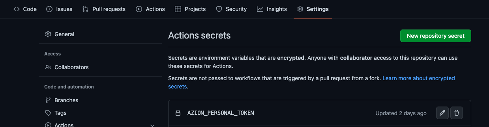
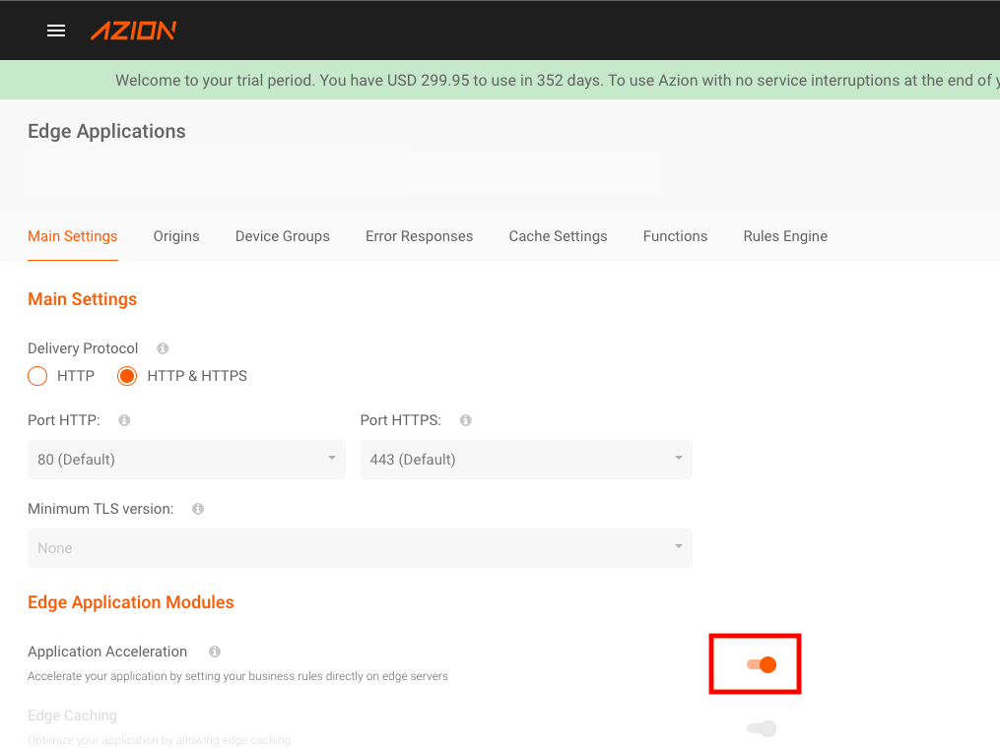

# 🚀 Welcome to the Azion Edge Computing!

## Overview

This template uses Action [edge-computing-deploy](https://github.com/marketplace/actions/edge-computing-deploy) to deploy.

---


# In just a few steps you can try it out:

## **1. Clone Repository**

Clone this repository or Click "use template".

*Please check the [./azion/azion.json](./azion/azion.json) file and update your project name if you wish.*


## **2. Create Azion RTM Account**

[Welcome to the Edge](https://manager.azion.com/signup/)

## **3. Create Azion Personal token and add in github secrets**

Create [Personal Token](https://manager.azion.com/iam/personal-tokens)

Add https://github.com/<<username>>/<<projectname>>/settings/secrets/actions

Secret Azion:
```bash
AZION_PERSONAL_TOKEN=<my personal token>
```

Adding the secrets 

## **4. Actions permissions**

**Important

Please enable permissions for the action to automate the update of the azion.json file.
[Config Actions](https://github.com/jcbsfilho/azion-sample-application/settings/actions)


https://docs.github.com/en/actions/security-guides/automatic-token-authentication#modifying-the-permissions-for-the-github_token


## **5. Create a pull request**

Create a pull request to the main branch to automatically deploy.

How create [Create Pull Request](https://docs.github.com/pt/pull-requests/collaborating-with-pull-requests/proposing-changes-to-your-work-with-pull-requests/creating-a-pull-request)

## **6. Automated config**

In the Actions file (workflows) [main.yml](.github/workflows/main.yml) the step of automating changes in the first build.

The build Action performs a change the first time in the [./azion/azion.json](./azion/azion.json) file, updating the resource id's.

*Change may be required if your main branch is protected*


## **7. Enable feature Application Acceleration**

If your deploy is successful!!! 

Enter the Edge Application menu on your RTM, look for your sample application and in Main Settings activate the Application Acceleration.

*Enable Application Acceleration to this site to use advanced rules engine, advanced cache key, bypass cache, forward cookies or support to proxy methods (post/put/patch/delete).*



***Please check the function arguments in the instance.***


